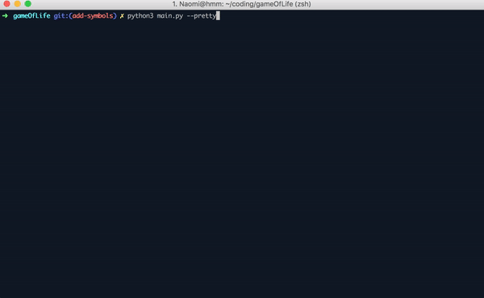
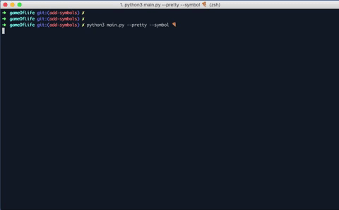

# Game of Life

## How to run this project:

```
$python3 main.py
10
12 12
0 0 0 0 0 0 0 0 0 0 0 0
0 0 0 0 0 0 0 0 0 0 0 0
0 0 0 0 0 0 0 0 0 0 0 0
0 0 0 0 0 0 0 0 0 0 0 0
0 0 0 0 0 0 0 0 0 0 0 0
0 1 1 1 1 1 1 1 1 1 1 0
0 0 0 0 0 0 0 0 0 0 0 0
0 0 0 0 0 0 0 0 0 0 0 0
0 0 0 0 0 0 0 0 0 0 0 0
0 0 0 0 0 0 0 0 0 0 0 0
0 0 0 0 0 0 0 0 0 0 0 0
0 0 0 0 0 0 0 0 0 0 0 0
```

## How to run the curses version of this project:



```
$python3 main.py --pretty --time 1.0
20
15 15
0 0 0 0 0 0 0 0 0 0 0 0 0 0 0
0 0 0 0 0 0 0 0 0 0 0 0 0 0 0
0 0 0 0 0 0 0 0 0 0 0 0 0 0 0
0 0 0 0 0 0 0 0 0 0 0 0 0 0 0
0 0 0 0 0 0 0 0 0 0 0 0 0 0 0
0 0 0 0 0 0 0 0 0 0 0 0 0 0 0
0 0 0 0 0 0 0 0 0 0 0 0 0 0 0
0 0 1 1 1 1 1 1 1 1 1 1 1 0 0
0 0 0 0 0 0 0 0 0 0 0 0 0 0 0
0 0 0 0 0 0 0 0 0 0 0 0 0 0 0
0 0 0 0 0 0 0 0 0 0 0 0 0 0 0
0 0 0 0 0 0 0 0 0 0 0 0 0 0 0
0 0 0 0 0 0 0 0 0 0 0 0 0 0 0
0 0 0 0 0 0 0 0 0 0 0 0 0 0 0
0 0 0 0 0 0 0 0 0 0 0 0 0 0 0
```

## How to run the simulation with a custom symbol:



```
$python3 main.py --pretty --time 1.0 --symbol 🍕
20
15 15
0 0 0 0 0 0 0 0 0 0 0 0 0 0 0
0 0 0 0 0 0 0 0 0 0 0 0 0 0 0
0 0 0 0 0 0 0 0 0 0 0 0 0 0 0
0 0 0 0 0 0 0 0 0 0 0 0 0 0 0
0 0 0 0 0 0 0 0 0 0 0 0 0 0 0
0 0 0 0 0 0 0 0 0 0 0 0 0 0 0
0 0 0 0 0 0 0 0 0 0 0 0 0 0 0
0 0 1 1 1 1 1 1 1 1 1 1 1 0 0
0 0 0 0 0 0 0 0 0 0 0 0 0 0 0
0 0 0 0 0 0 0 0 0 0 0 0 0 0 0
0 0 0 0 0 0 0 0 0 0 0 0 0 0 0
0 0 0 0 0 0 0 0 0 0 0 0 0 0 0
0 0 0 0 0 0 0 0 0 0 0 0 0 0 0
0 0 0 0 0 0 0 0 0 0 0 0 0 0 0
0 0 0 0 0 0 0 0 0 0 0 0 0 0 0
```

## Optimization:

In an effort to reduce unnecessary computations, we only iterate over living cells and while doing so construct a dictionary to keep track of how often any neighbor of a living cell is accessed. These counts allow us to check which cells are to come alive in the next step. By comparing both implementations with two small tests we can see big improvements in this implementation as compared to the implementation as of `37d0abc`.

A further optimization effort could be to only recompute state in areas where change has occurred.

```
$python3 -m timeit -n 20 -r 5 -s  'from game_of_life_old import GameOfLife; game = GameOfLife(20, 41, 11, {(12, 1), (36, 6), (4, 8), (18, 4), (15, 1), (21, 9), (25, 1), (36, 3), (14, 9), (8, 5), (32, 2), (18, 1), (12, 9), (5, 5), (25, 4), (11, 5), (36, 8), (32, 7), (14, 1), (20, 9), (18, 9), (8, 2), (18, 2), (4, 5), (26, 9), (25, 7), (7, 5), (8, 7), (32, 4), (4, 2), (27, 9), (33, 1), (6, 5), (11, 7), (36, 5), (11, 8), (13, 5), (18, 7), (35, 9), (33, 9), (25, 2), (36, 2), (8, 4), (32, 1), (4, 7), (25, 5), (11, 2), (35, 1), (29, 9), (12, 5), (32, 6), (8, 9), (22, 9), (32, 9), (18, 8), (25, 8), (15, 5), (36, 7), (4, 9), (14, 5), (8, 1), (18, 5), (4, 4), (28, 9), (34, 1), (11, 1), (8, 6), (32, 3), (4, 1), (11, 4), (36, 9), (34, 9), (36, 4), (11, 9), (18, 6), (25, 3), (36, 1), (13, 1), (8, 3), (19, 9), (18, 3), (4, 6), (25, 6), (11, 3), (8, 8), (32, 5), (4, 3), (15, 9), (13, 9), (32, 8), (25, 9), (11, 6)}, 0)' 'game.simulate()'
20 loops, best of 5: 52.5 msec per loop

$python3 -m timeit -n 20 -r 5 -s  'from game_of_life import GameOfLife; game = GameOfLife(20, 41, 11, {(12, 1), (36, 6), (4, 8), (18, 4), (15, 1), (21, 9), (25, 1), (36, 3), (14, 9), (8, 5), (32, 2), (18, 1), (12, 9), (5, 5), (25, 4), (11, 5), (36, 8), (32, 7), (14, 1), (20, 9), (18, 9), (8, 2), (18, 2), (4, 5), (26, 9), (25, 7), (7, 5), (8, 7), (32, 4), (4, 2), (27, 9), (33, 1), (6, 5), (11, 7), (36, 5), (11, 8), (13, 5), (18, 7), (35, 9), (33, 9), (25, 2), (36, 2), (8, 4), (32, 1), (4, 7), (25, 5), (11, 2), (35, 1), (29, 9), (12, 5), (32, 6), (8, 9), (22, 9), (32, 9), (18, 8), (25, 8), (15, 5), (36, 7), (4, 9), (14, 5), (8, 1), (18, 5), (4, 4), (28, 9), (34, 1), (11, 1), (8, 6), (32, 3), (4, 1), (11, 4), (36, 9), (34, 9), (36, 4), (11, 9), (18, 6), (25, 3), (36, 1), (13, 1), (8, 3), (19, 9), (18, 3), (4, 6), (25, 6), (11, 3), (8, 8), (32, 5), (4, 3), (15, 9), (13, 9), (32, 8), (25, 9), (11, 6)}, 0)' 'game.simulate()'
20 loops, best of 5: 12.5 msec per loop


$python3 -m timeit -n 20 -r 5 -s  'from game_of_life_old import GameOfLife; game = GameOfLife(20, 15, 15, {(7, y+1) for y in range(13)}, 0)' 'game.simulate()'
20 loops, best of 5: 24 msec per loop

$python3 -m timeit -n 20 -r 5 -s  'from game_of_life import GameOfLife; game = GameOfLife(20, 41, 11, {(7, y+1) for y in range(13)}, 0)' 'game.simulate()'
20 loops, best of 5: 2.36 msec per loop

```
